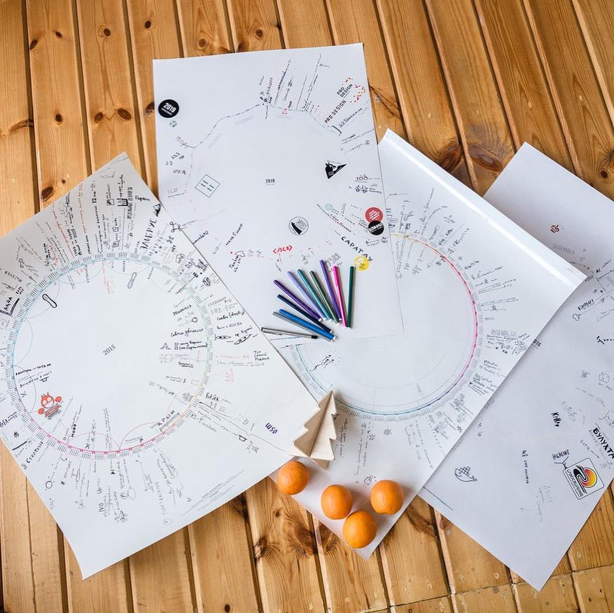

<section id="kruglendar-image" markdown="1">
{:.kruglendar-preview}
<!--{:.kruglendar-preview}-->
</section>

<section id="description" class="half-width" markdown="1">
Kruglendar — the diary poster
===

{{ page.description | markdownify }}


</section>

<section id="whatfor" class="half-width" markdown="1">
What for
===

Remember about special events
---
With the Kruglendar, you will never forget to buy presents on your friend's birthday or flowers on your anniversary.  You can mark concerts, exams, and sport events that you don’t want to miss.

Meet deadlines
---
The best way to reach a goal is to set a deadline and feel it approaching. Set milestones to your projects to finish them by the deadline.

Plan trips
---
Mark departure and arrival times, keep your to do list linked to your calendar.

Uh, right, you are not actually going to take the calendar with you to your journey, but it’s still helpful.

Keep memories
---
Write down your achievements and document the year’s special moments. Years from now, you could look back on all the happiest moments of your life

Make habits
---
Play the “making habits” game! Make a checklist of 1—3 tasks to do daily. Mark the days when you accomplished everything you aimed to do.

Here’s my checklist:

- Get up at 8:00AM
- Read at least one page of a book.

When you feel you’ve made it a habit, remove it from the checklist to start a new one.

Mark events without specific date
---
Sometimes you know an approximate event date only. Draw it somewhere around dates, far from the circle.

It allows you to make approximate plans, to note long term events like reading books or taking courses.

</section>


<section id="whatfor" markdown="1">
In the wild
===

{:.examples}
</section>


<section>

</section>

<section id="social-tools">


</section>

<section>

</section>


